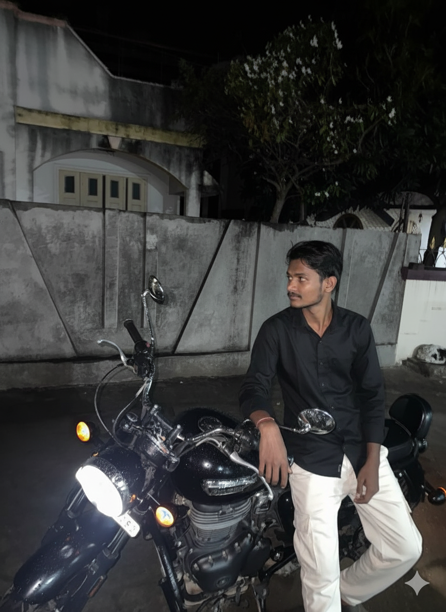

<!-- 🧭 HEADER -->

  

  <h1>👋 Hi, I’m <strong>Girish Balaso Lade</strong></h1>
  <h3>✨ UX/UI Engineer • AI Tool Builder • Creative Technologist ✨</h3>
  
  

    
    
    
    
    
    
  

---

## 🧠 About Me

Hey! I’m **Girish**, a **UX/UI-focused developer** passionate about creating tools that merge **artistic design** and **practical engineering**.  
I craft **AI-integrated developer platforms**, **design systems**, and **automation-driven experiences**.  
My approach blends design psychology with technical precision — **engineering that feels human**.

> “I don’t just write code — I compose it.”

---

## ⚙️ Professional Focus

| Category | Description |
|-----------|--------------|
| 🎨 **Design Philosophy** | Crafting minimal, emotion-driven, accessible interfaces with Figma & Tailwind |
| 💻 **Development Stack** | TypeScript, Next.js, Supabase, Firebase, Genkit, Swift, Kotlin |
| 🤖 **AI Engineering** | AI agents, LLM orchestration, caching systems, automation workflows |
| 🚀 **Builder Mindset** | Open-source SaaS tools for developers — focused on speed, simplicity & scalability |
| 🌍 **Creative Ecosystem** | Building **Lade Stack** — a platform for free, powerful AI + dev tools |

---

## 🛠️ Tech Toolbox

  

---

## 🌟 Featured Projects

| Project | Description | Tech Stack |
|----------|--------------|-------------|
| 🧠 [**AetherCanvas**](https://github.com/girishlade111/AetherCanvas-AI-Image-Generation-Studio-Ideogram-Style-) | AI Image Generation Studio (Ideogram Style) | TypeScript, Next.js |
| ⚡ [**Synergy Flow**](https://github.com/girishlade111/Synergy-Flow) | Productivity & automation system for creative developers | TypeScript |
| 💬 [**GB Coder (Beta)**](https://github.com/girishlade111/GB-Coder-Public-Beta) | AI coding assistant | TypeScript |
| 🧩 [**Lade Stack Dev Hub**](https://github.com/girishlade111/lade-stack-ai-dev-hub) | Centralized ecosystem hub | TypeScript |
| 🎨 [**Lade Studio**](https://github.com/girishlade111/Lade-Studio) | Modern design studio for UI/UX prototyping | TypeScript |

---

## 📊 GitHub Insights

  
  

  

---

## 🧾 Detailed Contributions Summary

| Year | Total Contributions | Commits | PRs | Issues | Repositories |
|------|---------------------|----------|-----|--------|---------------|
| **2025 (YTD)** | 3,183+ | ~3.8k | 16 | 42 | 614+ |
| **2024** | 297 | — | — | — | — |

  
  

> 💡 “Consistency builds momentum — momentum builds mastery.”

---

## 💡 My Creative Vision

I’m building **Lade Stack** — an ecosystem of free AI-integrated tools for developers, designers, and digital creators.  
Each project is crafted to **simplify complexity**, **elevate creativity**, and **democratize technology**.

### 🚀 Core Values
- Build tools that **empower creators**
- Design experiences that **feel alive**
- Ship fast, learn faster, **iterate endlessly**
- Keep everything **open-source & human-friendly**

---

## 🖼️ Visual Identity

  
  
  

---

## 📫 Connect With Me

- 🌐 **Website:** [https://ladestack.in](https://ladestack.in)  
- 💌 **Email:** [girish@ladestack.in](mailto:girish@ladestack.in)  
- 💼 **LinkedIn:** [Girish Lade](https://www.linkedin.com/in/girish-lade-075bba201/)  
- 📷 **Instagram:** [@girish_lade_](https://www.instagram.com/girish_lade_/)  
- 🧠 **GitHub:** [girishlade111](https://github.com/girishlade111)  
- 💻 **CodePen:** [Girish Lade](https://codepen.io/Girish-Lade-the-looper)

---

  <h3>“Building the future, one pixel and one line of code at a time.”</h3>
   
  

